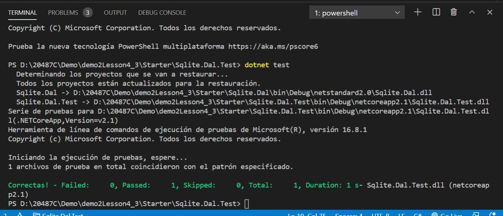
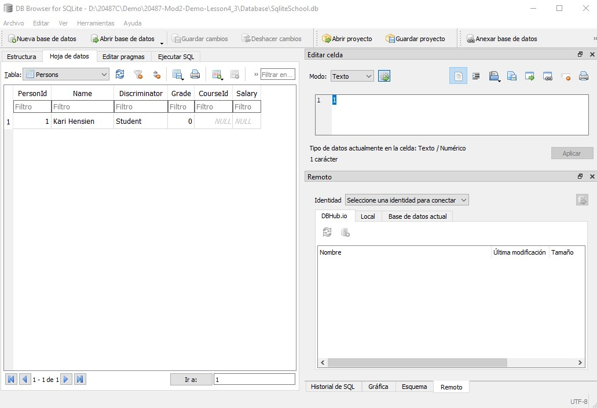

# Module 2: Querying and Manipulating Data Using Entity Framework

# Lesson 4: Manipulating Data

### Demonstration: Using Entity Framework with SQLite

- Abrimos el proyecto de consola Sqlite en Visual Studio Code 
- Añadimos el paquete Microsoft.EntityFrameworkCore.Sqlite
- En la clase **DBSqliteTest** del subproyecto **Sqlite.Dal.Test** añadimos la propiedad **_options** 
- Ejecutar

**DB Browser for SQLite**

